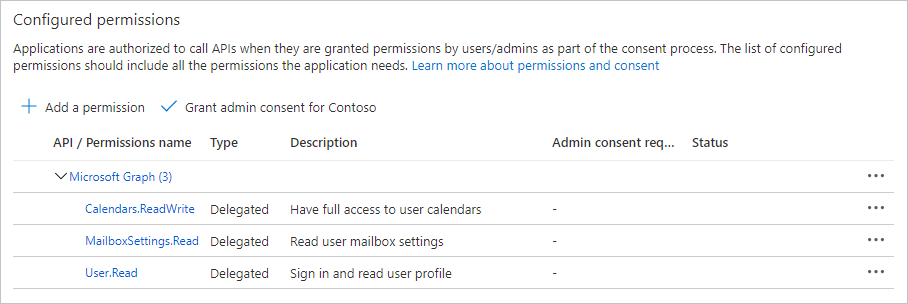

<!-- markdownlint-disable MD002 MD041 -->

在此练习中，你将使用 Azure Active Directory 管理中心创建新的 Azure AD Web 应用程序注册。

1. 打开浏览器，并转到 [Azure Active Directory 管理中心](https://aad.portal.azure.com)。 使用 **个人帐户**（亦称为“Microsoft 帐户”）或 **工作或学校帐户** 登录。

1. 选择左侧导航栏中的“**Azure Active Directory**”，再选择“**管理**”下的“**应用注册**”。

    

1. 选择“新注册”。 在 **"注册应用程序"** 页上，按如下所示设置值，其中是上一节中复制的 `YOUR_NGROK_URL` ngrok 转发 URL。

    - 将“名称”设置为“`Teams Graph Tutorial`”。
    - 将“受支持的帐户类型”设置为“任何组织目录中的帐户和个人 Microsoft 帐户”。
    - 在“重定向 URI”下，将第一个下拉列表设置为“`Web`”，并将值设置为“`YOUR_NGROK_URL/authcomplete`”。

    

1. 选择“**注册**”。 在 **"Teams Graph** 教程"页上，复制应用程序 (客户端) **ID** 并保存它，下一步中将需要该值。

    

1. 选择“管理”下的“身份验证”。 找到 **隐式授予** 部分并启用 **访问令牌****和 ID 令牌**。 选择“**保存**”。

1. 选择“管理”下的“证书和密码”。 选择“新客户端密码”按钮。 在 Description 中 **输入** 值，然后选择"到期"选项之 **一，然后选择**"**添加"。**

1. 离开此页前，先复制客户端密码值。 将在下一步中用到它。

    > [!IMPORTANT]
    > 此客户端密码不会再次显示，所以请务必现在就复制它。

1. 在 **"管理"下****选择** API 权限，然后选择 **"添加权限"。**

1. 选择 **Microsoft Graph，** 然后选择 **委派权限**。

1. 选择以下权限，然后选择"**添加权限"。**

    - **Calendars.ReadWrite** - 这将允许应用读取和写入用户的日历。
    - **MailboxSettings.Read** - 这将允许应用从用户的邮箱设置获取用户的时区、日期格式和时间格式。

    

## 配置 Teams 单一登录

在此部分中，你将更新应用注册以支持 Teams [中的单一登录](/microsoftteams/platform/tabs/how-to/authentication/auth-aad-sso)。

1. 选择 **"公开 API"。** 选择 **应用程序** **ID URI 旁边的"设置"链接**。 插入您的 ngrok forwarding URL 域名， (双正斜杠和 GUID 之间的末尾) 带正斜杠"/"。 整个 ID 应类似于： `api://50153897dd4d.ngrok.io/ae7d8088-3422-4c8c-a351-6ded0f21d615` 。

1. 在此 **API 定义的"范围**"部分，选择 **"添加范围"。** 按如下所示填写字段，然后选择"**添加范围"。**

    - **范围名称：**`access_as_user`
    - **谁可以同意？：管理员和用户**
    - **管理员同意显示名称：**`Access the app as the user`
    - **管理员同意说明：**`Allows Teams to call the app's web APIs as the current user.`
    - **用户同意显示名称：**`Access the app as you`
    - **用户同意说明：**`Allows Teams to call the app's web APIs as you.`
    - **状态：已启用**

    

1. 在"**授权客户端应用程序**"部分，选择 **"添加客户端应用程序"。** 输入以下列表中的客户端 ID，在"授权范围"下启用范围，然后选择 **"添加应用程序"。** 对列表中的每个客户端 ID 重复此过程。

    - `1fec8e78-bce4-4aaf-ab1b-5451cc387264` (Teams 移动/桌面应用程序) 
    - `5e3ce6c0-2b1f-4285-8d4b-75ee78787346` (Teams Web 应用程序) 
