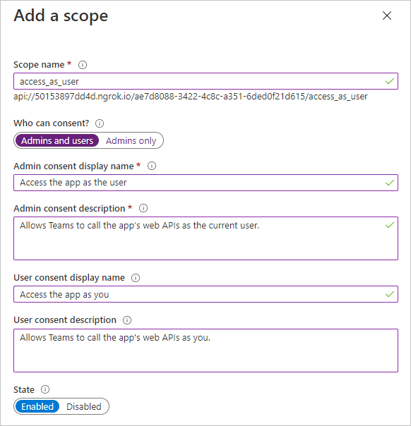

<!-- markdownlint-disable MD002 MD041 -->

在此练习中，你将使用 Azure Active Directory 管理中心创建新的 Azure AD Web 应用程序注册。In this exercise, you will create a new Azure AD web application registration using the Azure Active Directory admin center.

1. 打开浏览器，并转到 [Azure Active Directory 管理中心](https://aad.portal.azure.com)。Open a browser and navigate to the [Azure Active Directory admin center](https://aad.portal.azure.com). 使用 **个人帐户**（亦称为“Microsoft 帐户”）或 **工作或学校帐户** 登录。Login using a **personal account** (aka: Microsoft Account) or **Work or School Account**.

1. 选择左侧导航栏中的“**Azure Active Directory**”，再选择“**管理**”下的“**应用注册**”。Select **Azure Active Directory** in the left-hand navigation, then select **App registrations** under **Manage**.

    

1. 选择“新注册”。Select **New registration**. 在 **"注册应用程序"** 页上，按如下所示设置值，其中是上一节中复制的 `YOUR_NGROK_URL` ngrok 转发 URL。On the **Register an application** page, set the values as follows, where `YOUR_NGROK_URL` is the ngrok forwarding URL you copied in the previous section.

    - 将“名称”设置为“`Teams Graph Tutorial`”。Set **Name** to `Teams Graph Tutorial`.
    - 将“受支持的帐户类型”设置为“任何组织目录中的帐户和个人 Microsoft 帐户”。Set **Supported account types** to **Accounts in any organizational directory and personal Microsoft accounts**.
    - 在“重定向 URI”下，将第一个下拉列表设置为“`Web`”，并将值设置为“`YOUR_NGROK_URL/authcomplete`”。Under **Redirect URI**, set the first drop-down to `Web` and set the value to `YOUR_NGROK_URL/authcomplete`.

    

1. 选择“**注册**”。Select **Register**. 在 **"Teams Graph** 教程"页上，复制应用程序 (客户端) **ID** 并保存它，下一步中将需要该值。On the **Teams Graph Tutorial** page, copy the value of the **Application (client) ID** and save it, you will need it in the next step.

    

1. 选择“管理”下的“身份验证”。Select **Authentication** under **Manage**. 找到 **隐式授予** 部分并启用 **访问令牌\*\*\*\*和 ID 令牌**。Locate the **Implicit grant** section and enable **Access tokens** and **ID tokens**. 选择“**保存**”。Select **Save**.

1. 选择“管理”下的“证书和密码”。Select **Certificates & secrets** under **Manage**. 选择“新客户端密码”按钮。Select the **New client secret** button. 在 Description 中 **输入** 值，然后选择"到期"选项之 **一，然后选择**"**添加"。**Enter a value in **Description** and select one of the options for **Expires** and select **Add**.

1. 离开此页前，先复制客户端密码值。Copy the client secret value before you leave this page. 将在下一步中用到它。You will need it in the next step.

    > [!IMPORTANT]
    > 此客户端密码不会再次显示，所以请务必现在就复制它。This client secret is never shown again, so make sure you copy it now.

1. 在 **"管理"下\*\*\*\*选择** API 权限，然后选择 **"添加权限"。**Select **API permissions** under **Manage**, then select **Add a permission**.

1. 选择 **Microsoft Graph，** 然后选择 **委派权限**。Select **Microsoft Graph**, then **Delegated permissions**.

1. 选择以下权限，然后选择"**添加权限"。**Select the following permissions, then select **Add permissions**.

    - **Calendars.ReadWrite** - 这将允许应用读取和写入用户的日历。**Calendars.ReadWrite** - this will allow the app to read and write to the user's calendar.
    - **MailboxSettings.Read** - 这将允许应用从用户的邮箱设置获取用户的时区、日期格式和时间格式。**MailboxSettings.Read** - this will allow the app to get the user's time zone, date format, and time format from their mailbox settings.

    

## 配置 Teams 单一登录Configure Teams single sign-on

在此部分中，你将更新应用注册以支持 Teams [中的单一登录](/microsoftteams/platform/tabs/how-to/authentication/auth-aad-sso)。In this section you'll update the app registration to support [single sign-on in Teams](/microsoftteams/platform/tabs/how-to/authentication/auth-aad-sso).

1. 选择 **"公开 API"。**Select **Expose an API**. 选择 **应用程序** **ID URI 旁边的"设置"链接**。Select the **Set** link next to **Application ID URI**. 插入您的 ngrok forwarding URL 域名， (双正斜杠和 GUID 之间的末尾) 带正斜杠"/"。Insert your ngrok forwarding URL domain name (with a forward slash "/" appended to the end) between the double forward slashes and the GUID. 整个 ID 应类似于： `api://50153897dd4d.ngrok.io/ae7d8088-3422-4c8c-a351-6ded0f21d615` 。The entire ID should look similar to: `api://50153897dd4d.ngrok.io/ae7d8088-3422-4c8c-a351-6ded0f21d615`.

1. 在此 **API 定义的"范围**"部分，选择 **"添加范围"。**In the **Scopes defined by this API** section, select **Add a scope**. 按如下所示填写字段，然后选择"**添加范围"。**Fill in the fields as follows and select **Add scope**.

    - **范围名称：**`access_as_user`**Scope name:** `access_as_user`
    - **谁可以同意？：管理员和用户****Who can consent?: Admins and users**
    - **管理员同意显示名称：**`Access the app as the user`**Admin consent display name:** `Access the app as the user`
    - **管理员同意说明：**`Allows Teams to call the app's web APIs as the current user.`**Admin consent description:** `Allows Teams to call the app's web APIs as the current user.`
    - **用户同意显示名称：**`Access the app as you`**User consent display name:** `Access the app as you`
    - **用户同意说明：**`Allows Teams to call the app's web APIs as you.`**User consent description:** `Allows Teams to call the app's web APIs as you.`
    - **状态：已启用****State: Enabled**

    

1. 在"**授权客户端应用程序**"部分，选择 **"添加客户端应用程序"。**In the **Authorized client applications** section, select **Add a client application**. 输入以下列表中的客户端 ID，在"授权范围"下启用范围，然后选择 **"添加应用程序"。**Enter a client ID from the following list, enable the scope under **Authorized scopes**, and select **Add application**. 对列表中的每个客户端 ID 重复此过程。Repeat this process for each of the client IDs in the list.

    - `1fec8e78-bce4-4aaf-ab1b-5451cc387264` (Teams 移动/桌面应用程序) `1fec8e78-bce4-4aaf-ab1b-5451cc387264` (Teams mobile/desktop application)
    - `5e3ce6c0-2b1f-4285-8d4b-75ee78787346` (Teams Web 应用程序) `5e3ce6c0-2b1f-4285-8d4b-75ee78787346` (Teams web application)
