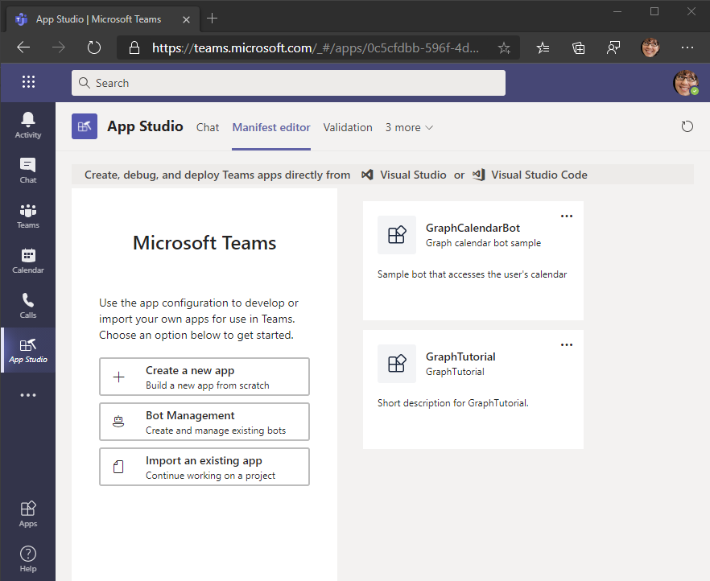

<!-- markdownlint-disable MD002 MD041 -->

应用清单介绍了应用如何与 Microsoft Teams 集成，并且安装应用是必需的。The app manifest describes how the app integrates with Microsoft Teams and is required to install apps. 在此部分中，你将使用 Microsoft Teams 客户端中的 App Studio 生成清单。In this section you'll use App Studio in the Microsoft Teams client to generate a manifest.

1. 如果你尚未在 Teams 中安装 App Studio， [则立即安装](/microsoftteams/platform/concepts/build-and-test/app-studio-overview)它。If you do not already have App Studio installed in Teams, [install it now](/microsoftteams/platform/concepts/build-and-test/app-studio-overview).

1. 在 Microsoft Teams 中启动 App Studio，然后选择 **清单编辑器**。Launch App Studio in Microsoft Teams and select the **Manifest editor**.

1. 选择 **"新建应用"。**Select **Create a new app**.

    

1. 在 **"应用详细信息** "页上，填写必填字段。On the **App details** page, fill in the required fields.

    > [!NOTE]
    > 可以使用"品牌"部分的默认 **图标** 或上传你自己的图标。You can use the default icons in the **Branding** section or upload your own.

1. 在左侧菜单上，选择 **"功能"** 下的 **"选项卡"。**On the left-hand menu, select **Tabs** under **Capabilities**.

1. 选择 **"添加\*\*\*\*个人"选项卡下的"添加"。**Select **Add** under **Add a personal tab**.

    

1. 按如下方式填写字段，其中是上一节中复制的 `YOUR_NGROK_URL` 转发 URL。Fill in the fields as follows, where `YOUR_NGROK_URL` is the forwarding URL you copied in the previous section. 选择 **"完成后** 保存"。Select **Save** when done.

    - **名称：**`Create event`**Name:** `Create event`
    - **实体 ID：**`createEventTab`**Entity ID:** `createEventTab`
    - **内容 URL：**`YOUR_NGROK_URL/newevent`**Content URL:** `YOUR_NGROK_URL/newevent`

1. 选择 **"添加\*\*\*\*个人"选项卡下的"添加"。**Select **Add** under **Add a personal tab**.

1. 按如下方式填写字段，其中是上一节中复制的 `YOUR_NGROK_URL` 转发 URL。Fill in the fields as follows, where `YOUR_NGROK_URL` is the forwarding URL you copied in the previous section. 选择 **"完成后** 保存"。Select **Save** when done.

    - **名称：**`Graph calendar`**Name:** `Graph calendar`
    - **实体 ID：**`calendarTab`**Entity ID:** `calendarTab`
    - **内容 URL：**`YOUR_NGROK_URL`**Content URL:** `YOUR_NGROK_URL`

1. 在左侧菜单上，选择"完成 **"下的"域和\*\*\*\*权限"。**On the left-hand menu, select **Domains and permissions** under **Finish**.

1. 通过 **应用注册将 AAD** 应用 ID 设置为应用程序 ID。Set the **AAD App ID** to the application ID from your app registration.

1. 通过 **应用注册将** 单一登录字段设置为应用程序 ID URI。Set the **Single-Sign-On** field to the application ID URI from your app registration.

1. 在左侧菜单上，选择"测试 **"，然后分发到"完成\*\*\*\*"下**。On the left-hand menu, select **Test and distribute** under **Finish**. 选择 **"下载"。**Select **Download**.

1. 在名为"清单"的项目的根目录中创建新 **目录**。Create a new directory in the root of the project named **Manifest**. 将下载的 ZIP 文件的内容提取到此目录。Extract the contents of the downloaded ZIP file to this directory.
