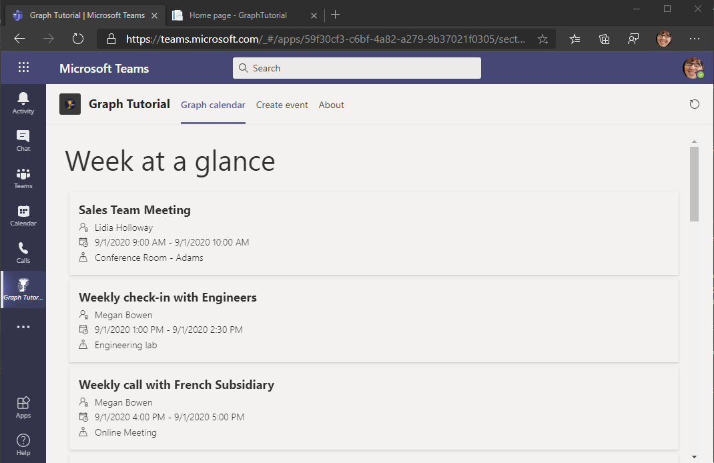

<!-- markdownlint-disable MD002 MD041 -->

在此部分中，你将 Microsoft Graph 合并到应用程序中。 对于此应用程序，你将使用 [适用于 .NET](https://github.com/microsoftgraph/msgraph-sdk-dotnet) 的 Microsoft Graph 客户端库调用 Microsoft Graph。

# 获取日历视图

日历视图是用户日历中两个时间点之间发生的一组事件。 你将使用它获取当前一周的用户事件。

1. 打开 **./Controllers/CalendarController.cs，** 将以下函数添加到 **CalendarController** 类。

    :::code language="csharp" source="../demo/GraphTutorial/Controllers/CalendarController.cs" id="GetStartOfWeekSnippet":::

1. 添加以下函数以处理从 Microsoft Graph 调用返回的异常。

    :::code language="csharp" source="../demo/GraphTutorial/Controllers/CalendarController.cs" id="HandleGraphExceptionSnippet":::

1. 将现有的 `Get` 函数替换为以下内容。

    :::code language="csharp" source="../demo/GraphTutorial/Controllers/CalendarController.cs" id="GetSnippet" highlight="2,14-57":::

    查看更改。 此函数的新版本：

    - 返回 `IEnumerable<Event>` 而不是 `string` 。
    - 使用 Microsoft Graph 获取用户的邮箱设置。
    - 使用用户的时区计算本周的开始和结束。
    - 获取日历视图
        - 使用函数包含标头，这将导致返回的事件的开始时间和结束时间转换为 `.Header()` `Prefer: outlook.timezone` 用户的时区。
        - 使用 `.Top()` 函数最多请求 50 个事件。
        - 使用 `.Select()` 函数仅请求应用使用的字段。
        - 使用 `OrderBy()` 函数按开始时间对结果进行排序。

1. 保存更改并重新启动该应用。 刷新 Microsoft Teams 中的选项卡。 应用显示事件的 JSON 列表。

## 显示结果

现在，你可以以更用户友好的方式显示事件列表。

1. 打开 **./Pages/Index.cshtml，** 在标记中添加以下 `<script>` 函数。

    :::code language="javascript" source="../demo/GraphTutorial/Pages/Index.cshtml" id="RenderHelpersSnippet":::

1. 将现有的 `renderCalendar` 函数替换为以下内容。

    :::code language="javascript" source="../demo/GraphTutorial/Pages/Index.cshtml" id="RenderCalendarSnippet":::

1. 保存更改并重新启动该应用。 刷新 Microsoft Teams 中的选项卡。 应用在用户日历上显示事件。

    
